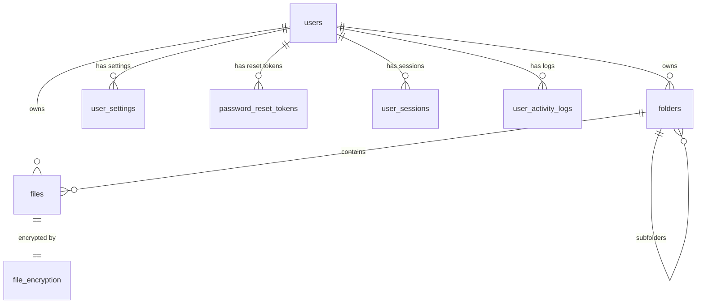

# Description of the app folder

The `app` folder contains the main source code of the BattareyCloud FastAPI application.

## Purpose
Modular architecture, test coverage, Docker support and scalability make the project ready for commercial implementation and customization.

## Structure
- **main.py**: FastAPI entry point. Application initialization, router connection, middleware setup (CORS, logging), startup events (e.g. MinIO check).
- **config.py**: Application configuration. Loading settings (database URL, Redis, MinIO, secrets) from environment variables via Pydantic `BaseSettings`.
- **core/**: Core components:
- `security.py`: Password hashing and verification (passlib).
- `encryption.py`: File encryption and decryption logic (cryptography).
- **db/**: Database connection and session management, GUID/JSON types.
- **models/**: SQLAlchemy ORM models (User, File, Folder, FileEncryption, UserSession, UserActivityLog, etc.).
- **repositories/**: Data access layer. CRUD operations and complex selections via SQLAlchemy.
- **routes/**: API endpoints (grouping by entities: users, files, folders, sessions, logs, etc.).
- **schemas/**: Pydantic schemas for validating request and response data.
- **utils/**: Utilities and clients for external services (MinIO, file previews, etc.).
- **__init__.py**: Makes the app folder a Python package.

## Benefits
- Clear separation of layers (routes, business logic, data access, models, schemes)
- Asynchrony for high performance
- Security: encryption, antivirus, validation, sessions, tokens
- Easy scalability and testability

# Description of business logic

- **Registration and authentication:** The user registers by email and password. The password is hashed with bcrypt. JWT is used to access the API.
- **File upload:** Files are encrypted (AES), saved in MinIO. After uploading, the ClamAV background scanning task is launched.
- **File deletion:** The file is marked as deleted (is_deleted=True), physically deleted from MinIO after 24 hours (background cleanup task).
- **Recycle bin:** Recovery is possible before physical deletion. The recycle bin displays only files marked for deletion.
- **Folders:** Nesting, moving, renaming, recursive deletion.
- **Statistics:** Number of files, total size, top 10 by size.
- **Sessions:** User session management (user_sessions).
- **Logs:** User activity logging (user_activity_logs).
- **Settings:** Individual user settings (user_settings).
- **Search and preview:** File search by name/type, preview generation for popular formats.

---

# Database diagram (in detail)

## Tables and fields (main)
| Table                 | Field            | Type         | Description                                      |
|-----------------------|------------------|--------------|--------------------------------------------------|
| users                 | id               | UUID (PK)    | Unique user identifier                           |
|                       | email            | TEXT, UNIQUE | Email                                            |
|                       | password_hash    | TEXT         | Password hash                                    |
|                       | created_at       | TIMESTAMP    | Registration date                                |
|                       | is_active        | BOOLEAN      | Whether the user is active                       |
|                       | is_superuser     | BOOLEAN      | Administrator flag                               |
| user_settings         | id               | UUID (PK)    | Unique settings identifier                       |
|                       | user_id          | UUID (FK)    | User (users.id)                                  |
|                       | key              | TEXT         | Setting key                                      |
|                       | value            | TEXT         | Value                                            |
| files                 | id               | UUID (PK)    | Unique file identifier                           |
|                       | filename         | TEXT         | File name                                        |
|                       | user_id          | UUID (FK)    | File owner (users.id)                            |
|                       | folder_id        | UUID (FK)    | Folder (folders.id), can be NULL                 |
|                       | size             | BIGINT       | File size (bytes)                                |
|                       | is_deleted       | BOOLEAN      | Deletion mark                                    |
|                       | uploaded_at      | TIMESTAMP    | Upload date                                      |
|                       | virus_checked    | BOOLEAN      | Whether checked by antivirus                     |
|                       | mimetype         | TEXT         | MIME type                                        |
|                       | download_count   | INT          | Download count                                   |
| folders               | id               | UUID (PK)    | Unique folder identifier                         |
|                       | name             | TEXT         | Folder name                                      |
|                       | user_id          | UUID (FK)    | Folder owner (users.id)                          |
|                       | parent_id        | UUID (FK)    | Parent folder (folders.id), NULL                 |
|                       | created_at       | TIMESTAMP    | Creation date                                    |
| file_encryption       | file_id          | UUID (PK,FK) | File (files.id)                                  |
|                       | key              | TEXT         | Encryption key (base64)                          |
|                       | iv               | TEXT         | Initialization vector (base64)                   |
| password_reset_tokens | id               | UUID (PK)    | Unique token identifier                          |
|                       | user_id          | UUID (FK)    | User (users.id)                                  |
|                       | token            | TEXT         | Token                                            |
|                       | created_at       | TIMESTAMP    | Creation date                                    |
|                       | used             | BOOLEAN      | Whether used                                     |
| user_sessions         | id               | UUID (PK)    | Unique session identifier                        |
|                       | user_id          | UUID (FK)    | User (users.id)                                  |
|                       | created_at       | TIMESTAMP    | Login time                                       |
|                       | expired_at       | TIMESTAMP    | Expiration time                                  |
| user_activity_logs    | id               | UUID (PK)    | Unique log identifier                            |
|                       | user_id          | UUID (FK)    | User (users.id)                                  |
|                       | action           | TEXT         | Action                                           |
|                       | created_at       | TIMESTAMP    | Event time                                       |

## Relationships and limitations
- One user can have many files, folders, sessions, logs, settings.
- Folders can be nested (parent_id).
- A file can only be in one folder or in the root (folder_id = NULL).
- Each file has an encryption record (file_encryption).
- When a user is deleted, his files, folders, settings, sessions, logs are deleted in cascade.
- A separate token table is used to reset the password.

## Mermaid diagram (example)


---

# API Request Examples

## User Registration
```http
POST /api/v1/auth/register
Content-Type: application/json
{
"email": "user@example.com",
"password": "StrongPassword123"
}
```

## File Upload
```http
POST /api/v1/files/upload
Authorization: Bearer <JWT>
Content-Type: multipart/form-data
file: <binary>
folder_id: <uuid>
```

## Getting a list of files
```http
GET /api/v1/files?folder_id=<uuid>
Authorization: Bearer <JWT>
```

## Getting user statistics
```http
GET /api/v1/files/stats
Authorization: Bearer <JWT>
```
Response:**
```json
{
"total_files": 42,
"total_size": 10485760,
"top_files": [
{"id": "uuid1", "filename": "bigfile.zip", "size": 5000000},
...
]
}
```

---

# Typical usage scenarios

1. **New user registers, uploads files, gets a download link.**
2. **User deletes file — it moves to the trash, physically deleted after 24 hours.**
3. **The user restores the file from the trash before 24 hours have passed.**
4. **The user receives statistics on their files and the top 10 largest files.**
5. **The user creates nested folders and moves files between them.**
6. **After the file is downloaded, an antivirus scan is automatically launched.**

---

# Installing and updating dependencies

All project dependencies are listed in `requirements.txt` (in the root of the BackEnd folder).

## Installing new libraries
1. Add the required library to `requirements.txt` (for example, `aiosqlite`).
2. If using Docker, rebuild the backend image:
```bash
docker-compose build backend
```

## Removing a library
1. Remove the line with the library from `requirements.txt`.
2. (Recommended) Rebuild the Docker image:
```bash
docker-compose build backend
```

---